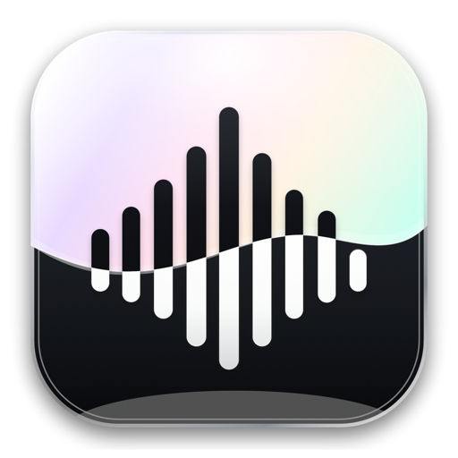

<p align="center">
  
</p>

<h1 align="center">whisp</h1>

<p align="center"><b>Fast, private, on-device dictation for macOS.</b></p>
<p align="center">Hold a key, speak, and your words appear in whatever app you're using.</p>

---

**whisp** turns your voice into text anywhere on your Mac. Press your hotkey, talk, and
what you say is transcribed **on-device** and inserted straight into your editor, your
email, your chat — no cloud, no account, no 500 MB Electron bundle. The whole thing is
native Swift and about **15 MB**.

## Why whisp

- 🔒 **Private** — speech is transcribed on your Mac and never leaves it.
- ⚡ **Fast & tiny** — native, ~15 MB, ready instantly.
- 🌍 **Works everywhere** — types into any app, just like a keyboard.
- ✨ **Optional AI cleanup** — strip filler words or reformat for email / chat / code.
  Basic clean-up runs on-device with no API key.

## Features

- **Three on-device engines** — FluidAudio Parakeet (default, multilingual), WhisperKit,
  and whisper.cpp.
- **Flexible hotkey** — *Toggle*, *Push-to-Talk*, or *Hybrid* (double-tap to toggle, hold
  to talk). Use a single modifier (🌐 fn / ⌃ / ⌥ / ⌘) or any key combo.
- **Notch indicator** — a Dynamic-Island-style pill under the menu bar while you record.
- **Formatting modes** — *Auto* (adapts to the focused app), *Clean-up*, *Email*,
  *Message*, *Code*, *Custom*. Only text is ever sent to an LLM — never audio.
- **Power Mode** — per-app formatting rules.
- **Command Mode** — select text, dictate an instruction ("make it shorter", "translate
  to English"), and whisp rewrites it in place.
- **Multilingual** — recognize several languages at once (e.g. English + Русский).
- **Make it yours** — accent color, font (System / Rounded / Serif / Mono), and interface
  language (System / English / Русский).
- **Stays out of the way** — lives in the menu bar and keeps running with the window closed.

## How it works

1. **Press your hotkey** — a pill appears under the notch.
2. **Speak** — whisp records and transcribes on-device, trimming silence automatically.
3. **Done** — your text, optionally cleaned up, is pasted into the active app.

## Build it yourself

Requires macOS 14.4+, Xcode 26.x, and [XcodeGen](https://github.com/yonaskolb/XcodeGen)
(`brew install xcodegen`).

```sh
xcodegen generate          # generate whisp.xcodeproj from project.yml
xcodebuild -project whisp.xcodeproj -scheme whisp -configuration Debug \
  -destination 'platform=macOS' CODE_SIGNING_ALLOWED=NO build
swift test                 # run the core test suite

packaging/build-dmg.sh     # → a styled, self-contained ~/Desktop/whisp.dmg
```

On first launch whisp asks for **Microphone** (to record) and **Accessibility** (to paste
text into other apps).

## License

Personal project — all rights reserved.
